

  <h1 style="font-size: 3em; color: #2c3e50;">CodeSphere</h1>
  

> ## Overview

  CodeSphere is a collaborative coding platform designed to enhance the coding learning experience for individuals in our institution. The platform encourages collaboration, provides an inclusive environment for both problem solvers and problem creators, and offers a user-friendly interface for efficient coding education.

> ## Features

<ul style="font-size: 1.1em; color: #7f8c8d; line-height: 1.6;">
  <li><b>User Authentication:</b>
    <ul>
      <li>A straightforward user authentication system for secure access.</li>
    </ul>
  </li>
  <li><b>Problem Bank:</b>
    <ul>
      <li>A diverse problem bank categorized by difficulty and topics.</li>
    </ul>
  </li>
  <li><b>Contest Creation:</b>
    <ul>
      <li>Allow users to create customized contests with various settings.</li>
    </ul>
  </li>
  <li><b>Real-time Scoreboard:</b>
    <ul>
      <li>Implement a real-time leaderboard displaying participants' standings during contests.</li>
    </ul>
  </li>
  <li><b>Discussion Forum:</b>
    <ul>
      <li>Include discussion forums for each problem to promote collaboration.</li>
    </ul>
  </li>
  <li><b>User Profiles and Statistics:</b>
    <ul>
      <li>Display user profiles with statistics, contest history, and ratings.</li>
    </ul>
  </li>
  <li><b>Notification System:</b>
    <ul>
      <li>Set up email to push notifications for upcoming contests and announcements.</li>
    </ul>
  </li>
  <li><b>Visual Representation:</b>
    <ul>
      <li>Integrate a visualizer for problem solutions, aiding in code understanding.</li>
    </ul>
  </li>
  <li><b>Finding Corner Cases:</b>
    <ul>
      <li>Assist in finding corner cases for different problem scenarios.</li>
    </ul>
  </li>
</ul>

## How to run this Project

<ol style="font-size: 1.1em; color: #2c3e50; line-height: 1.6;">
  <li>Download Zip file & Open it in VS Code or similar IDE
  </li>
  <li>Navigate to the project directory:
    <pre><code>cd demo_project</code></pre>
  </li>
  <li>Run Backend:
    <code>cd backend</code>
    <code>npm install</code>
    <code>node index.js</code>
  </li>
   <li>Run Frontend:
    <code>cd frontend</code>
    <code>npm install</code>
    <code>npm start</code>
  </li>
</ol>

> ## Installation

<ol style="font-size: 1.1em; color: #2c3e50; line-height: 1.6;">
  <li>Clone the repository:
    <pre><code>git clone https://github.com/UmmeKulsumTumpa/SPL_02.git</code></pre>
  </li>
  <li>Navigate to the project directory:
    <pre><code>cd SPL_02</code></pre>
  </li>
  <li>Install the dependencies:
    <pre><code>npm install</code></pre>
  </li>
  <li>Start the development server:
    <pre><code>npm start</code></pre>
  </li>
</ol>

> ## Screenshots

  <h3>Home Page</h3>
  
  
The home page provides an overview of CodeSphere's features and recent updates, making it easy for users to navigate and find relevant information.

  <h3>User Login</h3>
  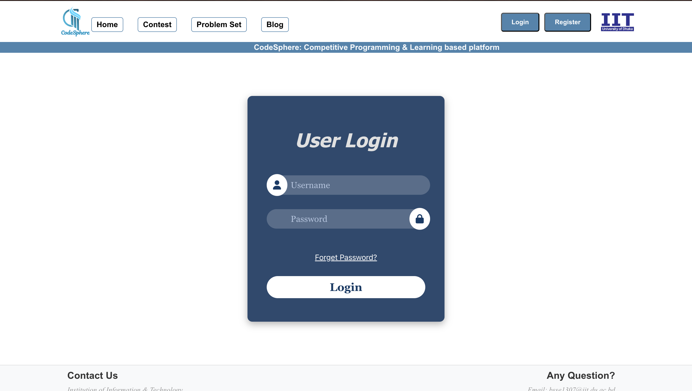
  
The user login page allows users to securely access their accounts.

  <h3>User Registration</h3>
  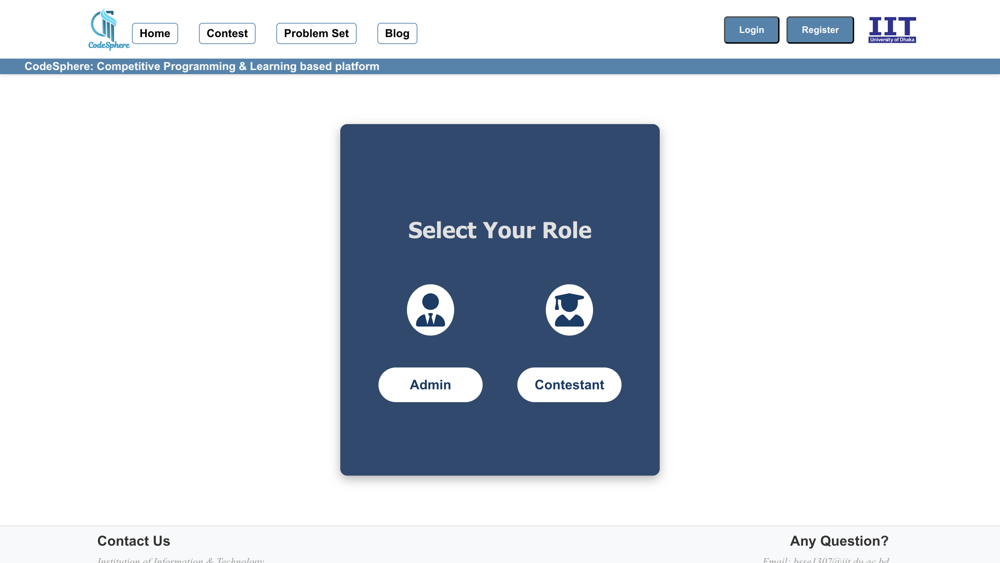
  
Separate registration for Admin and Contestant

  <h3>Admin Registration</h3>
  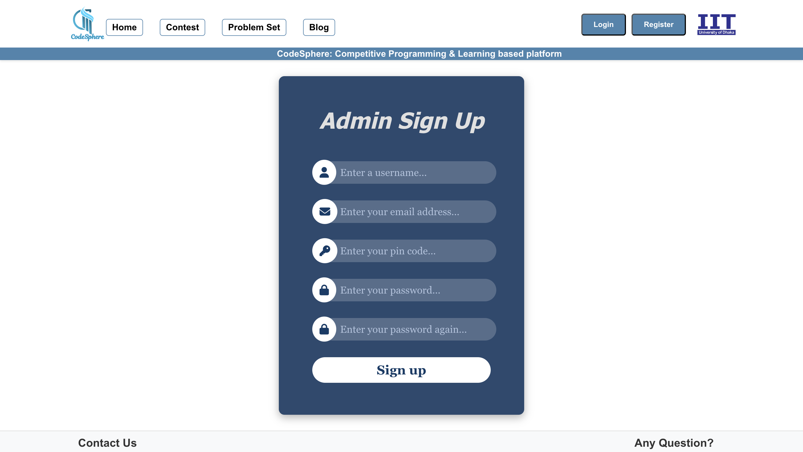
  
The admin registration page for new admin sign-ups.

  <h3>Admin Manage Contest</h3>
  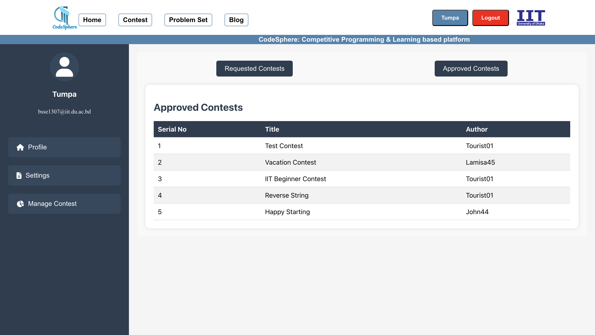
  
Admins can manage contests, including approval and participation settings.

  <h3>Contests Page</h3>
  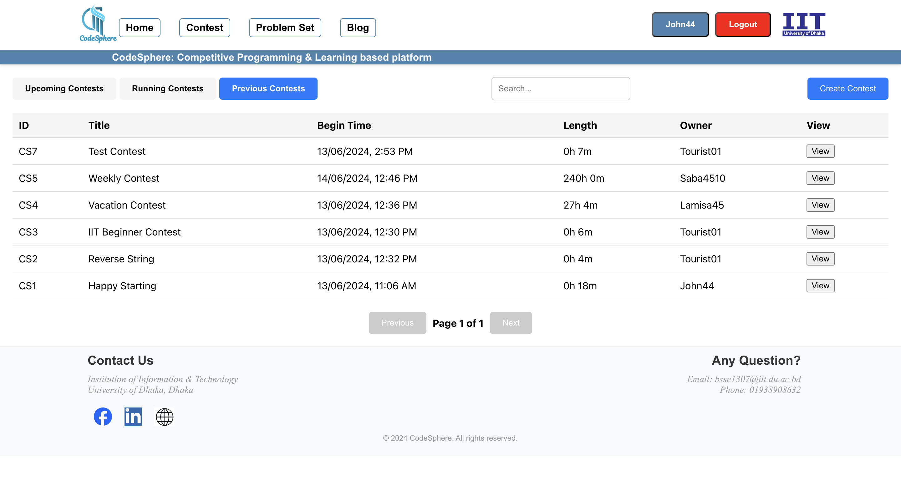
  
The contests page lists all available contests, categorized by upcoming, running, and previous contests. Users can view details and participate in any contest.

  <h3>Owner Participation Restriction</h3>
  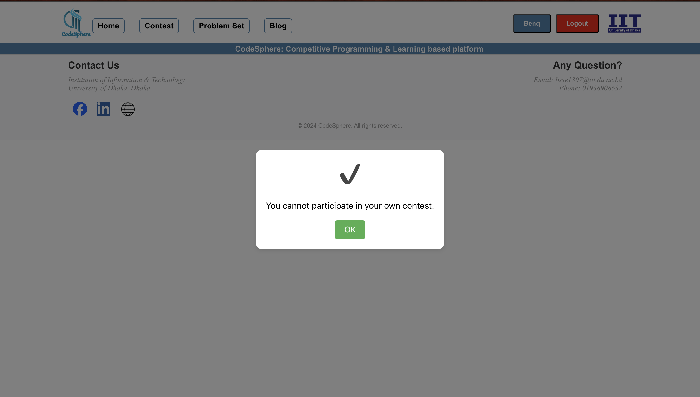
  
CodeSphere ensures fairness by restricting contest creators from participating in their own contests.

  <h3>Admin Cannot Create Contest</h3>
  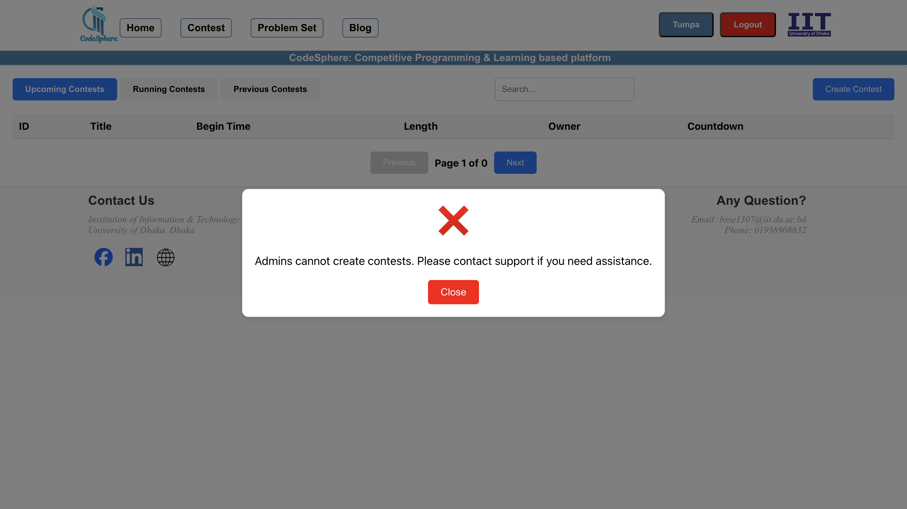
  
Admins cannot create contests, ensuring they focus on platform management.

  <h3>Create Contest</h3>
  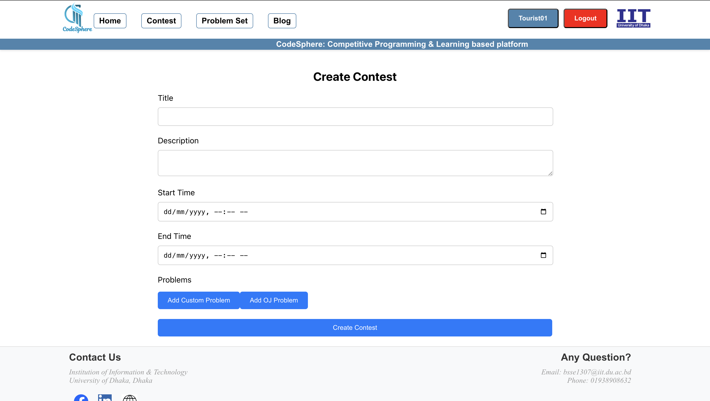
  
Users can create new contests with custom settings.

  <h3>Participate in Contest</h3>
  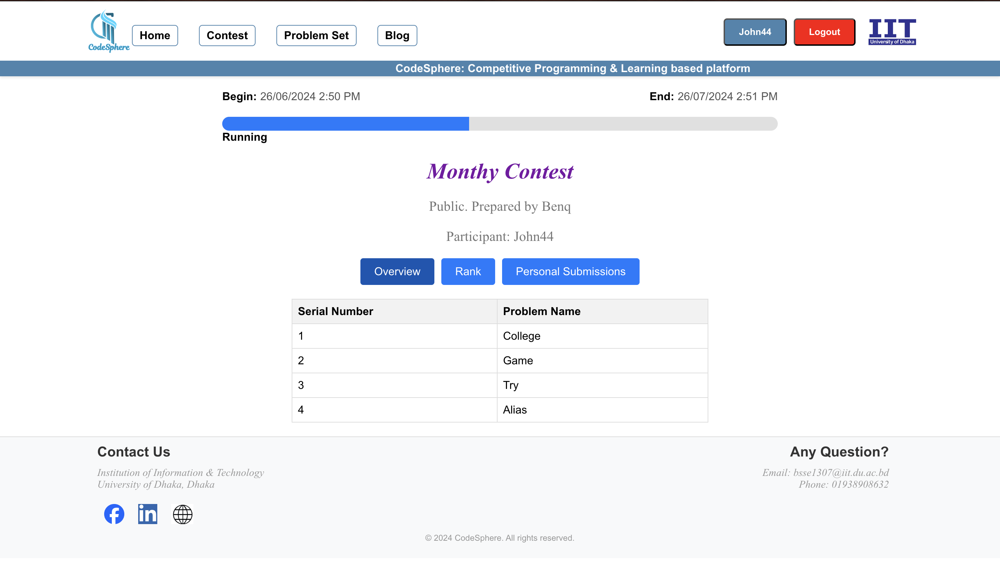
  
Users can participate in contests, view contest details, and track their progress in real-time.

  <h3>Previous Contest Results</h3>
  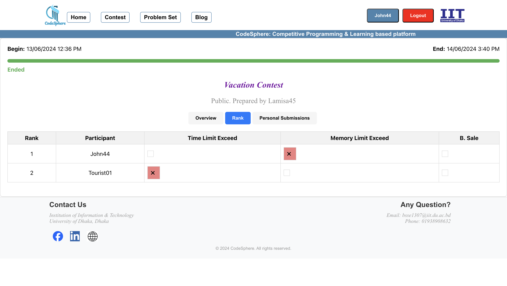
  
Users can view the results of previous contests, including rankings and performance metrics.

  <h3>Problem Set</h3>
  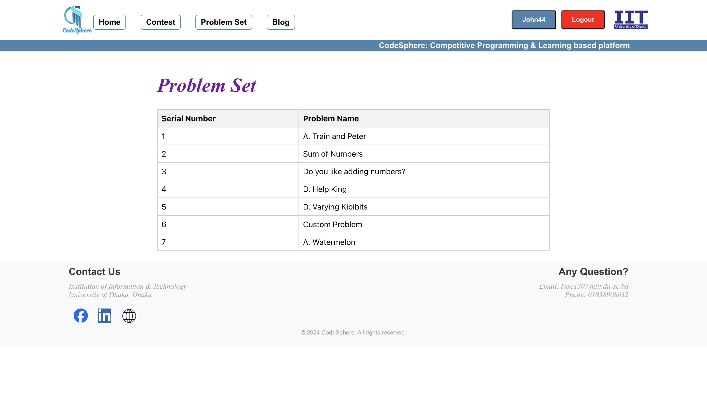
  
The problem set page displays all available problems, allowing users to practice and improve their coding skills.

  <h3>User Contest Management</h3>
  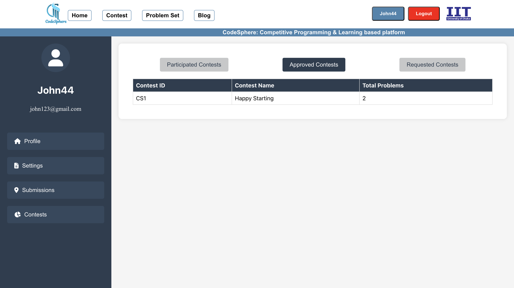
  
Users can manage their participated, approved, and requested contests from their dashboard.

  <h3>User Profile</h3>
  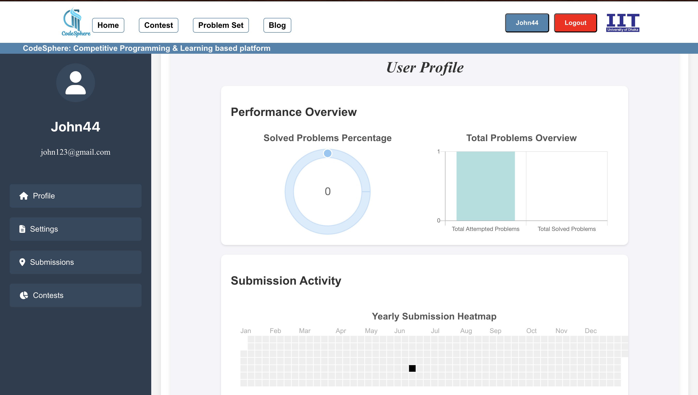
  
The user profile page provides an overview of a user's performance, submission activity, and statistics.

  <h3>User Submissions</h3>
  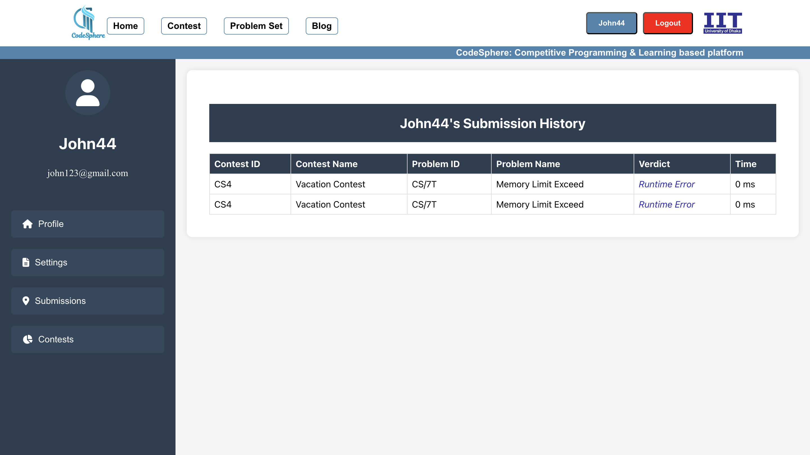
  
Users can view their submission history, including problem details, verdicts, and execution times.

> ## Future Scopes

<ul style="font-size: 1.1em; color: #7f8c8d; line-height: 1.6;">
  <li><b>Advanced Analytics:</b>
    <ul>
      <li>Implement advanced analytics for user performance and contest statistics.</li>
    </ul>
  </li>
  <li><b>Machine Learning Integration:</b>
    <ul>
      <li>Integrate machine learning algorithms to provide personalized problem recommendations.</li>
    </ul>
  </li>
  <li><b>Mobile Application:</b>
    <ul>
      <li>Develop a mobile application to enhance accessibility and user experience.</li>
    </ul>
  </li>
  <li><b>Internationalization:</b>
    <ul>
      <li>Add support for multiple languages to cater to a global audience.</li>
    </ul>
  </li>
</ul>
